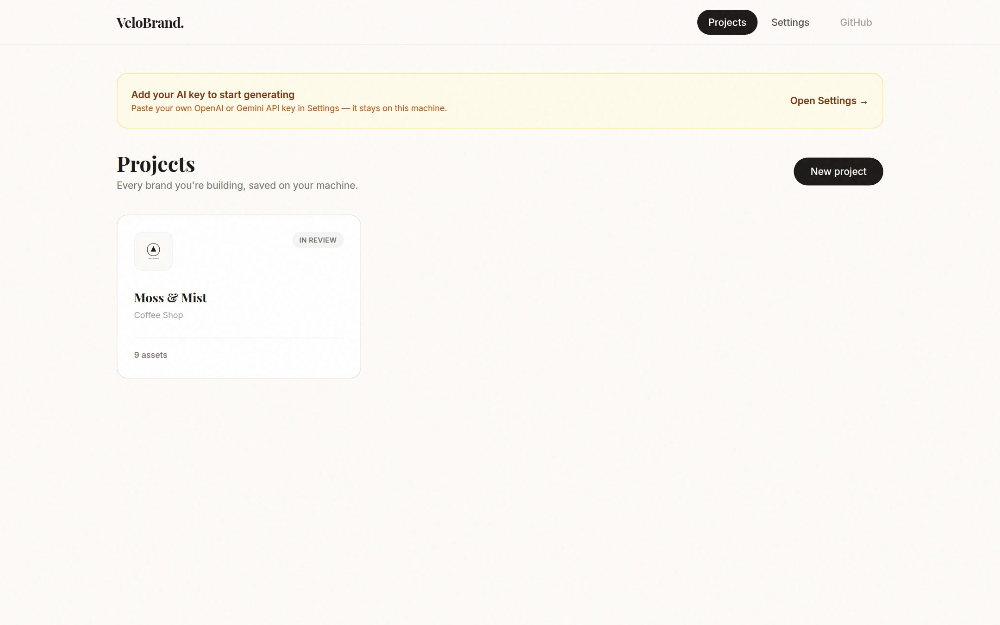
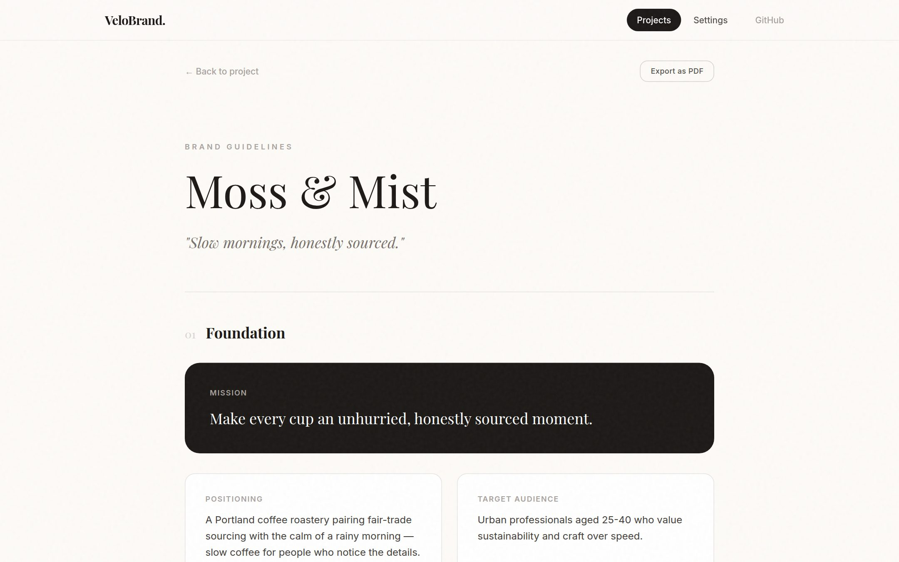
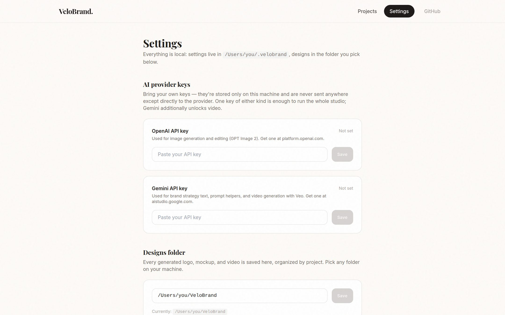

<div align="center">

# VeloBrand Studio

**A complete AI brand studio that runs on your machine.** Describe a business — or paste its website — and get a full brand: logo concepts, brand identity and guidelines, mockups, business cards, social templates, and cinematic video. Install it, paste your own API key in Settings, and every design is saved to a folder you choose.

[](https://github.com/hemoyt/velobrandstudio-/actions/workflows/ci.yml)
[](LICENSE)
[](https://nextjs.org)
[](#how-it-stores-your-work)

</div>

---

## Install & run

```bash
git clone https://github.com/hemoyt/velobrandstudio-.git
cd velobrandstudio-
npm install
npm run dev
```

Open [http://localhost:3000](http://localhost:3000), go to **Settings**, paste your OpenAI and/or Gemini API key, and pick the folder where your designs should be saved. That's the entire setup — no database, no account, no environment variables.

- One key of either kind runs the whole studio (logos, identity, mockups).
- A **Gemini** key additionally unlocks video generation (Veo).
- Keys are stored only on your machine (`~/.velobrand/settings.json`) and are sent nowhere except directly to the provider.

## Tour

| | |
|---|---|
|  **Landing** — the pitch: a complete brand studio on your machine. |  **Projects** — every brand you're building, with a setup nudge until a key is added. |
|  **Dashboard** — strategy, palette, typography, and every asset, with the exact folder your files live in. |  **Brand guidelines** — a full, live style guide: mission, values, logo usage rules, color system, type, voice. Exportable as PDF. |
|  **Settings** — paste your API keys and choose your designs folder. Nothing leaves your machine. |  **Motion Lab** — turn the logo or a prompt into cinematic video with Veo. |

## What you get per project

1. **Brief** — write a description, import it from an existing website, or upload your own logo. AI-enhance the wording if you want.
2. **Logo concepts** — four directions per run across eight styles (minimalist, vintage, luxury, abstract, mascot, hand-drawn, cyberpunk, 3D), plus app-icon / website-header / profile variants of the winner.
3. **Brand identity** — mission, values, personality, tagline, voice, target audience, a color palette with usage weighting, and a Google Fonts pairing.
4. **Brand guidelines** — a live page in the app (and a printable PDF) with logo clear-space and minimum-size rules, do's and don'ts, the color system with hex/RGB, and typography samples.
5. **Collateral** — industry-aware mockups (tech, fashion, retail, hospitality, coffee, general), business cards, letterhead, email signature, presentation cover, favicon set, and social templates — generated concurrently around your chosen logo.
6. **Motion** — text- or logo-to-video with aspect ratio, resolution, and sound controls.
7. **In-browser editor** — logo placement, text layers, undo history, AI smart-erase and freeform edits on any asset.

## How it stores your work

Everything is a plain file you can see:

```
~/.velobrand/                     # app data (change with VELOBRAND_HOME)
  settings.json                   # your API keys + chosen designs folder
  projects/<id>.json              # one record per project

<your designs folder>/            # chosen in Settings (default ~/VeloBrand)
  moss-and-mist/
    logos/                        # every generated logo + variants
    mockups/                      # coffee cup, letterhead, signage...
    business-cards/
    social-templates/
    social-posts/
    videos/                       # Veo renders as .mp4
```

Deleting a project in the app only removes its record — your design files are never touched. If you change the designs folder later, move the existing project folders across so older projects keep displaying.

## Providers & models

| Capability | Runs on | Notes |
|---|---|---|
| Image generation & editing | OpenAI **GPT Image 2** (preferred) or Gemini | Whichever key you've added; OpenAI wins if both. |
| Brand identity & prompt helpers | Gemini `gemini-2.5-flash` (preferred) or OpenAI `gpt-4o-mini` | Works with either key. |
| Video | Gemini **Veo 3.1** only | OpenAI has no video model. |

## Run with Docker

```bash
docker compose up --build
```

Settings and designs persist in named volumes; swap the `velobrand-designs` volume for a bind mount (e.g. `./designs:/data/designs`) to browse your files directly on the host — that's the path you'd pick in Settings.

## Good to know

- **This is a local, single-user tool.** There's no login — anyone who can reach the port can use the studio and read its files, so keep it on localhost or behind your own reverse-proxy auth if you expose it. Serverless platforms (Vercel, etc.) won't work: the app needs a persistent filesystem.
- **Website import** fetches the URL you paste from your machine, with localhost/private-IP ranges blocked as an accident guardrail.
- **Video takes minutes** — that's Veo rendering, not the app hanging. The MP4 lands in your designs folder when done.
- **No job queue** — generation runs in-request, which is fine for one person; keep the tab open during a big kit build.

## Contributing

See [CONTRIBUTING.md](CONTRIBUTING.md).

## License

[MIT](LICENSE)
