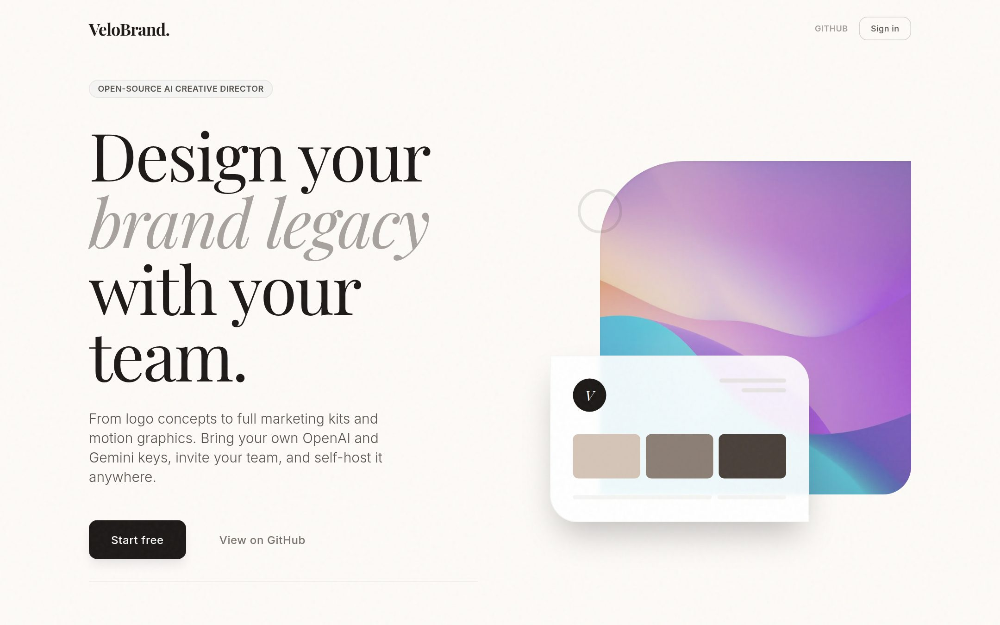
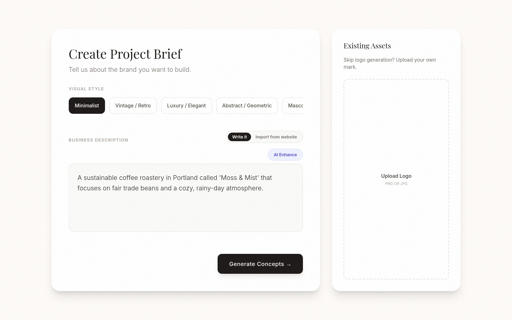
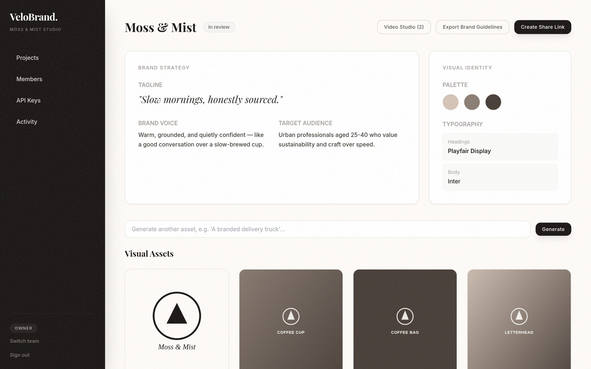
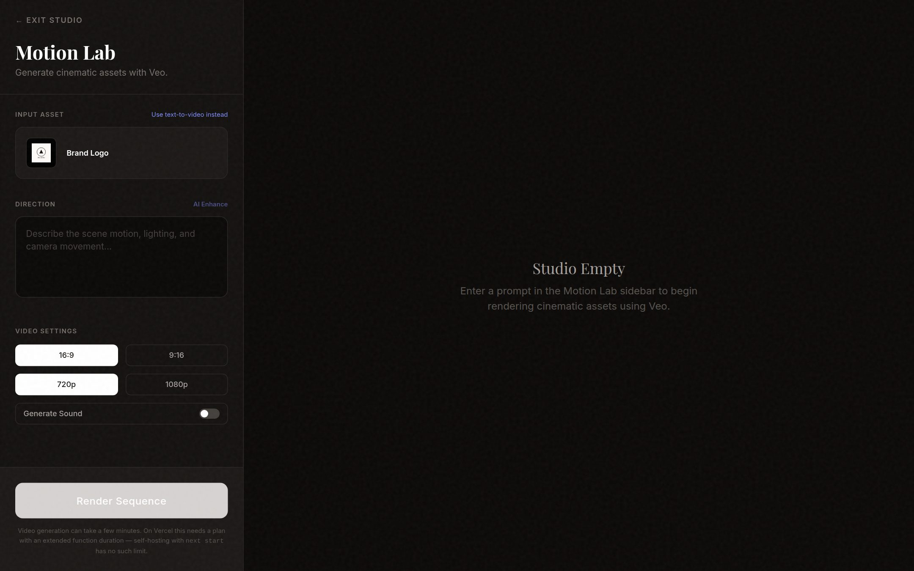
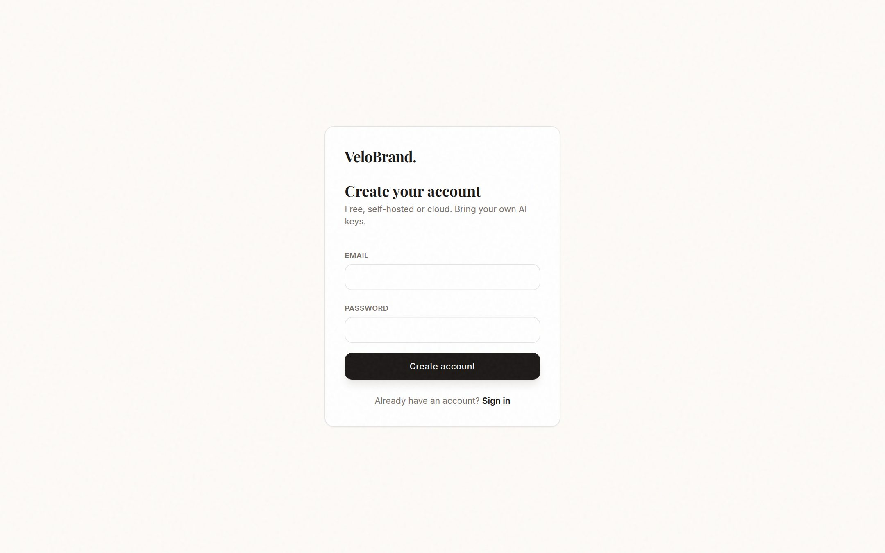

<div align="center">

# VeloBrand Studio

**An open-source, team-based AI brand studio.** Describe a business — or paste its website — and generate a complete brand kit: logo concepts, brand strategy, mockups, business cards, social templates, brand guidelines, and cinematic video. Built for teams, self-hostable anywhere, bring your own AI keys.

[](https://github.com/hemoyt/velobrandstudio-/actions/workflows/ci.yml)
[](LICENSE)
[](https://nextjs.org)
[](#self-host-with-docker)

</div>

---

## What it does

VeloBrand Studio takes a project from a one-paragraph brief to a launch-ready brand kit, entirely inside your own team workspace:

1. **Brief** — write a business description, paste a website URL to import, or upload an existing logo.
2. **Curate** — pick a visual direction and select from AI-generated logo concepts.
3. **Package** — choose the deliverables you need: business cards, social templates, industry-aware mockups, and core brand essentials (letterhead, email signature, presentation cover, favicon/app-icon set).
4. **Launch** — review the full kit, export a real brand guidelines document, generate cinematic video in the Motion Lab, and share a read-only link.

No shared billing, no vendor lock-in: every team brings its own OpenAI and/or Gemini API key, and the whole thing runs as a normal Next.js app you can self-host.

## Tour

| | |
|---|---|
|  **Landing** — the pitch, in three steps: brief, curate, launch. |  **Brief** — describe the business (or import it from a website), pick a visual style, or upload an existing logo. |
|  **Brand kit dashboard** — strategy, palette, typography, and every generated asset in one place, with one-click brand guidelines export. |  **Motion Lab** — turn the logo (or a text prompt) into cinematic video with Veo. |
|  **Sign up** — free, self-hosted or cloud, bring your own AI keys. | |

## Features

- **Start from a brief or an existing website** — write a business description, or paste a URL and let Gemini read the page and draft the brief for you.
- **Logo generation & selection** — multiple concepts per brief, styled (minimalist, vintage, luxury, cyberpunk, and more).
- **Brand identity** — AI-generated tagline, brand voice, target audience, color palette, and typography.
- **Full asset packages** — industry-aware mockups (tech, fashion, retail, hospitality, coffee, general), business cards, social templates, and core brand essentials (letterhead, email signature, presentation cover slide, favicon/app-icon set) — generated concurrently.
- **Brand guidelines export** — a real style-guide document, not just an asset sheet: logo clear-space and minimum-size rules, do's and don'ts, color usage weighting, and the full strategy core, ready to print or save as a PDF.
- **In-browser image editor** — logo placement, text layers, undo history, and AI-powered smart erase / freeform edits.
- **Motion Lab** — text- or logo-to-video generation with Google Veo (aspect ratio, resolution, and sound).
- **Teams** — invite members by email, four roles (owner/admin/editor/viewer) enforced by Postgres row-level security, an activity log, and optional per-project sharing.
- **Bring your own AI keys** — each team adds its own OpenAI and/or Gemini API key, encrypted at rest. No central billing, no usage caps set by us.
- **Shareable read-only links** for a finished brand kit.
- **Self-hostable** — runs as a normal Next.js server (Docker) or on Vercel.

## Tech stack

- [Next.js](https://nextjs.org) (App Router) — UI + API routes, works as a plain Node server or Vercel serverless.
- [Supabase](https://supabase.com) — Postgres, Auth, and Storage. Free hosted tier or [self-hosted](https://supabase.com/docs/guides/self-hosting).
- **Image generation**: OpenAI's [GPT Image 2](https://developers.openai.com/api/docs/models/gpt-image-2) (preferred), with Gemini as a fallback if only a Gemini key is configured.
- **Text & video**: Google Gemini (`gemini-2.5-flash` for text, Veo 3.1 for video — OpenAI has no video model).

## Quickstart (cloud)

1. Create a free project at [supabase.com](https://supabase.com).
2. In the Supabase SQL editor, run the files in [`supabase/migrations/`](supabase/migrations) in order.
3. Deploy this repo to Vercel (or run locally — see below). Set the environment variables from [`.env.example`](.env.example): your Supabase URL/anon key/service role key, and a generated `ENCRYPTION_KEY` (`openssl rand -base64 32`).
4. Sign up, create a team, and add your OpenAI and/or Gemini API key from **Team Settings → API Keys**. Nothing works without at least one provider key — this app never ships a shared key.

## Run locally

```bash
npm install
cp .env.example .env.local   # fill in Supabase URL/keys + ENCRYPTION_KEY
npm run dev
```

Generated logos, mockups, and videos are written straight to a `design/` folder next to the repo — that's the default storage backend outside of Vercel, so there's nothing extra to configure for local use. Set `STORAGE_BACKEND=supabase` in `.env.local` if you'd rather keep everything in Supabase Storage instead (this is required, and auto-selected, when deploying to Vercel — see [Known limitations](#known-limitations)).

## Self-host with Docker

```bash
cp .env.example .env
# fill in .env, then:
docker compose up --build
```

This only runs the app container — point `NEXT_PUBLIC_SUPABASE_URL` at Supabase's hosted free tier (fastest) or your own [self-hosted Supabase stack](https://supabase.com/docs/guides/self-hosting/docker).

## How keys and permissions work

- **Provider keys are per-team, not per-user or global.** An admin adds an OpenAI/Gemini key in Team Settings; it's encrypted with `ENCRYPTION_KEY` before it touches the database and is only decrypted server-side, inside the API route making the provider call. It is never sent to the browser.
- **Roles**: `viewer` (read-only) < `editor` (generate/edit assets, create projects) < `admin` (manage members, invites, and keys) < `owner` (also delete the team). Enforced both in the UI and — the part that actually matters — via Postgres row-level security policies in [`supabase/migrations/20260711000000_init.sql`](supabase/migrations/20260711000000_init.sql).
- Any editor+ can *use* a configured provider key to generate assets; only admins can *view or manage* keys.

## Known limitations

- **Local storage backend isn't for serverless.** The default `local` backend writes to a `design/` folder on disk, which doesn't persist on Vercel — it's auto-switched to `supabase` there. If you self-host on a platform with an ephemeral filesystem (not a normal VM/Docker host), set `STORAGE_BACKEND=supabase` explicitly.
- **Website import fetches whatever URL a team member pastes**, from the server. It blocks the obvious cases (localhost, private/internal IP ranges, non-HTTP schemes) via a DNS pre-check, but a sophisticated DNS-rebinding attack could still slip past that check before the actual fetch — treat this as reducing, not eliminating, SSRF risk, and don't expose it to untrusted users beyond your own team members (it already requires editor+ access).
- **Video generation and Vercel's function timeout**: Veo generation can take minutes. Self-hosting with `next start`/Docker has no timeout; on Vercel you'll need a plan that supports an extended `maxDuration` for `app/api/ai/video/route.ts`.
- **No job queue** — image/video generation runs synchronously inside the request. Fine for the current scale; a background queue would be the next step for heavier usage.
- **Per-project sharing** (`project_shares` table) is implemented in the schema and RLS but has no dedicated settings UI yet — it can be managed directly via SQL/the Supabase dashboard today.
- **Email delivery for invites** is optional (via [Resend](https://resend.com), `RESEND_API_KEY`); without it, invite links are shown in the UI for manual sharing rather than emailed automatically.

## Contributing

See [CONTRIBUTING.md](CONTRIBUTING.md).

## License

[MIT](LICENSE)
